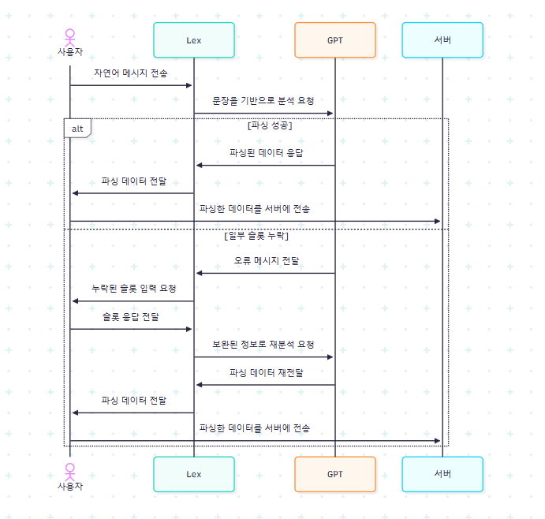

# 💬 Talk to Do! 챗봇

AWS Lex와 OpenAI GPT를 활용한 자연어 할 일 관리 챗봇 Lambda 함수입니다.

## 📋 프로젝트 구조

```
chatbot-lambda/
├── index.js          # Lambda 핸들러 (메인 엔트리 포인트)
├── constants.js      # 상수 및 메시지 정의
├── utils.js          # 유틸리티 함수 (날짜, 응답 생성)
├── gpt.js            # OpenAI API 호출
├── handlers.js       # 비즈니스 로직 핸들러
└── public/
    └── image.png     # 플로우차트
```

## 🔄 처리 플로우



1. **사용자 입력 수신** → Lex에서 전달된 자연어 또는 날짜 보완 입력
2. **날짜 보완 처리** → `MissingDate` 슬롯이 있으면 GPT로 날짜 해석 후 완료
3. **자연어 분석** → GPT로 할 일과 날짜 추출
   - 날짜 없음 → 사용자에게 날짜 요청 (ElicitSlot)
   - 날짜 있음 → 할 일 목록 반환 (Fulfilled)

## 🚀 주요 기능

- 자연어로 할 일 입력 및 날짜 추출
- 상대적 날짜 표현 처리 ("오늘", "내일", "3일 뒤" 등)
- 날짜가 없는 경우 자동으로 사용자에게 요청
- 모듈화된 코드 구조로 유지보수 용이

## 📦 설치

```bash
npm install
```

## ⚙️ 환경 변수

- `OPENAI_API_KEY`: OpenAI API 키

## 📝 사용 예시

**입력**: "내일 회의 준비하고 다음 주 금요일에 보고서 작성해줘"

**출력**:

```json
{
  "type": "todoList",
  "data": [
    { "task": "회의 준비", "date": "2025-01-XX" },
    { "task": "보고서 작성", "date": "2025-01-XX" }
  ]
}
```
